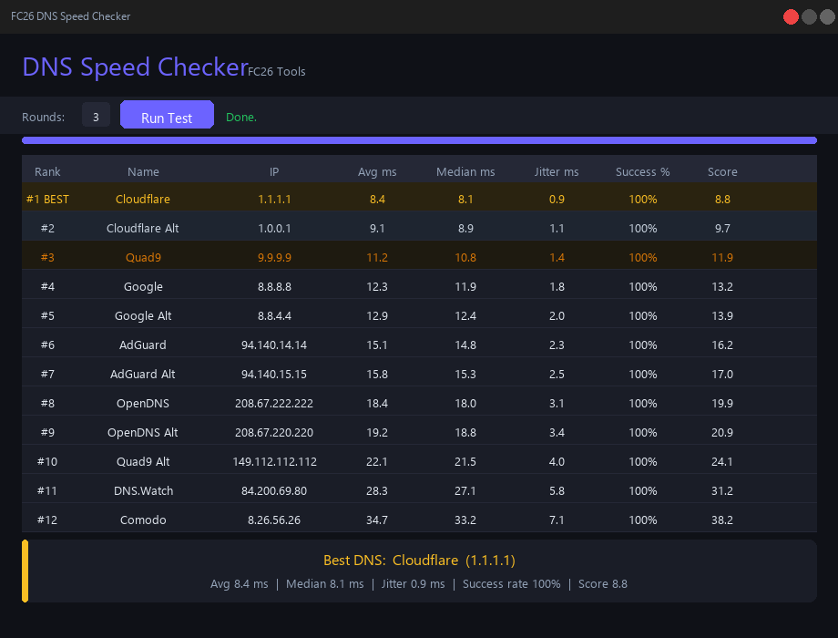

# dns-speed-checker
DNS Speed Checker tool for Windows – FC26 Tools

## Preview

# FC26 DNS Speed Checker

A lightweight Windows tool that tests 12 popular DNS servers and tells you 
which one is the fastest for your connection.

## Features
- Tests 12 DNS servers: Cloudflare, Google, OpenDNS, Quad9, AdGuard and more
- Measures average latency, median, jitter and success rate
- Smart scoring system that weighs speed, stability and reliability
- Ranks all servers from best to worst with medal display
- Shows the best DNS server clearly at the bottom after the test
- Adjustable test rounds (1–10) for more accurate results
- Dark mode UI, no installation required

## Download
Download the latest version from the [Releases](../../releases/latest) page.  
Just run the .exe — no Python or any other software needed.

## How to use
1. Download fc26_dns_checker.exe
2. Double-click to run
3. Click "Run Test" and wait
4. The best DNS server for your connection is shown at the bottom

## Recommended next step
Enter the best DNS server in your router (e.g. FritzBox, TP-Link, Asus...) under  
**Internet → Access Data → DNS Server** to speed up browsing on all your devices.

## DNS Servers tested
| Name | IP |
|---|---|
| Cloudflare | 1.1.1.1 |
| Cloudflare Alt | 1.0.0.1 |
| Google | 8.8.8.8 |
| Google Alt | 8.8.4.4 |
| OpenDNS | 208.67.222.222 |
| Quad9 | 9.9.9.9 |
| AdGuard | 94.140.14.14 |
| DNS.Watch | 84.200.69.80 |
| Comodo | 8.26.56.26 |

---
Made by Kaden · FC26 Tools
